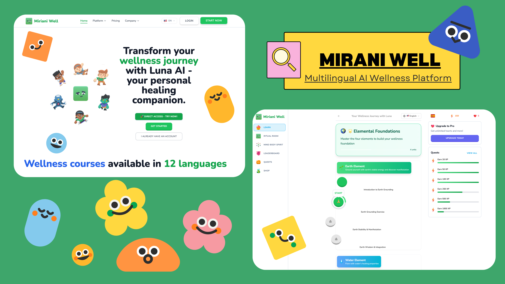

# Miriani Well - AI Wellness Companion Platform



[](https://github.com/MirianiWell/miriani-well-platform/blob/main/LICENSE "Proprietary License")
[](https://github.com/MirianiWell/miriani-well-platform/commits/main "Maintenance")
[](https://mirianiwell.com "Company")
[](https://mirianiwell.com "AI Powered")

## About Miriani Well

**Miriani Well** is your comprehensive digital wellness companion - combining the wisdom of ancient healing practices with the power of modern AI to support your personal growth journey, available 24/7 on any device.

**Inspired by Duolingo's gamified learning approach**, Miriani Well transforms wellness into an engaging, progressive journey with Luna, your AI companion, guiding you through elemental healing practices, mood tracking, and personalized spiritual growth.

**Client:** Dr. Uzo Nwankpa - Founder & CEO  
**Company:** Miriani Well Inc.  
**Lead Developer:** StynerDev Development Team  
**Website:** [mirianiwell.com](https://mirianiwell.com)  
**Platform:** Multilingual AI-Powered Wellness Experience

## 🌟 Core Features & Benefits

### 🤖 1. AI Healing Companion - "Luna"
Your personal AI wellness coach available 24/7
- **Compassionate emotional support** - Like having a therapist in your pocket
- **Personalized healing guidance** - Tailored advice based on your unique journey
- **Emotional pattern tracking** - Monitors progress and identifies growth areas
- **Custom affirmations & coping strategies** - Adaptive support when you need it most
- **Natural conversation** - Chat naturally with Luna for instant support

**Client Benefit:** Like having a therapist and life coach in your pocket, always available when you need support

### 🌍 2. Elemental Healing Rituals
Guided practices based on the four elements for holistic wellness:

#### 🌱 Earth Element
- Grounding exercises for stability
- Manifestation work and goal setting
- Stability practices for life balance

#### 💧 Water Element  
- Emotional healing and cleansing rituals
- Flow practices for adaptability
- Cleansing ceremonies for renewal

#### 🔥 Fire Element
- Energy work and vitalization
- Transformation practices
- Passion building and motivation

#### 💨 Air Element
- Breathwork and meditation
- Mental clarity enhancement
- Communication improvement

**Client Benefit:** Holistic healing approaches that address mind, body, and spirit

### 📊 3. Smart Wellness Dashboard
Your personal wellness command center
- **Progress tracking** - Monitor your healing journey over time
- **Mood pattern analysis** - Understand emotional trends and triggers
- **Personalized insights** - AI-powered recommendations for optimal wellness
- **Milestone celebrations** - Acknowledge achievements and growth
- **Visual analytics** - Clear charts and progress indicators

**Client Benefit:** Clear visibility into your wellness progress with actionable insights

### 📝 4. Guided Journaling & Reflection
Sacred space for personal growth and self-discovery
- **Guided prompts** - Structured questions for deeper reflection
- **Gratitude tracking** - Daily appreciation practices
- **Emotional processing** - Safe space to work through feelings
- **Growth insights** - Patterns and breakthroughs identification

**Client Benefit:** Develops self-awareness and emotional intelligence

### 💬 5. Personalized Affirmations Library
Curated collection of positive affirmations
- **Daily affirmations** - Delivered based on your current needs
- **Categorized by life areas** - Self-love, confidence, success, relationships
- **AI-powered personalization** - Adapts to your journey and progress
- **Custom affirmations** - Create your own meaningful statements

**Client Benefit:** Builds positive mindset and self-belief

### 📈 6. Mood Tracking & Analytics
Intelligent emotional wellness monitoring
- **Daily emotional check-ins** - Quick mood assessments
- **Pattern identification** - Recognize triggers and positive influences
- **Emotional growth insights** - Track improvements over time
- **Trend analysis** - Understand your emotional cycles

**Client Benefit:** Better understanding of emotional patterns and triggers

## 🚀 Technology & Accessibility

### Platform Features
- **Mobile-First Design** - Fully responsive, works perfectly on all devices
- **Progressive Web App** - Install on your phone for native app experience
- **Secure Authentication** - Safe, private account with enterprise-grade data protection
- **Cloud Sync** - Access your data anywhere, anytime
- **Offline Capability** - Key features work without internet connection

### AI Integration
- **Google Gemini AI** - Advanced AI for personalized guidance and natural conversations
- **Adaptive Learning** - AI learns your preferences and improves recommendations over time
- **Natural Language Processing** - Understand and respond to complex emotional needs
- **Predictive Analytics** - Anticipate your wellness needs and suggest proactive support

## 📱 Daily Use Experience

### 🌅 Morning Routine
- Start with personalized affirmations and intention setting
- Review Luna's daily wellness recommendations
- Set elemental healing focus for the day

### 🌞 Throughout the Day
- Quick check-ins with Luna for support and guidance
- Access healing rituals during stressful moments
- Mood tracking and emotional awareness

### 🌙 Evening Practice
- Reflection journaling and gratitude practice
- Review daily progress and insights
- Prepare for restorative sleep with calming rituals

### 📅 Weekly Benefits
- Review progress and insights on your wellness dashboard
- Adjust healing practices based on patterns
- Celebrate milestones and achievements

## 🎯 Perfect For

- **Individuals seeking emotional support** and guidance
- **People interested in mindfulness** and spiritual growth
- **Those wanting to track mental health** improvements
- **Anyone looking for personalized wellness** practices
- **Users preferring AI-powered support** that's always available
- **Spiritual seekers** combining ancient wisdom with modern technology

## 🛠️ Tech Stack

- **Frontend:** Next.js 14, React 18, TypeScript
- **Styling:** Tailwind CSS, Radix UI Components
- **Database:** PostgreSQL with Drizzle ORM
- **Authentication:** Clerk (Secure user management)
- **AI Integration:** Google Gemini AI for Luna companion
- **Payments:** Stripe (Subscription management)
- **Deployment:** Vercel (Production-ready hosting)
- **State Management:** Zustand
- **Animations:** Framer Motion
- **Audio/Media:** React Use Sound for immersive experiences

## 🚀 Getting Started

### Prerequisites
- Node.js 18+ and npm/yarn
- PostgreSQL database
- Clerk account for authentication
- Google Gemini API key for AI features
- Stripe account for payments

### Installation

1. Clone the repository:
```bash
git clone https://github.com/StynerDev/miriani-well-wellness-platform.git
cd miriani-well-wellness-platform
```

2. Install dependencies:
```bash
npm install --legacy-peer-deps
```

3. Set up environment variables:
```bash
cp .env.example .env.local
```

4. Configure your environment variables in `.env.local`:
```env
# Database
DATABASE_URL=your_postgresql_connection_string

# Clerk Authentication
NEXT_PUBLIC_CLERK_PUBLISHABLE_KEY=your_clerk_publishable_key
CLERK_SECRET_KEY=your_clerk_secret_key

# Google Gemini AI (for Luna)
GOOGLE_GEMINI_API_KEY=your_google_gemini_api_key

# Stripe
STRIPE_API_KEY=your_stripe_api_key
STRIPE_WEBHOOK_SECRET=your_stripe_webhook_secret

# App Configuration
NEXT_PUBLIC_APP_URL=http://localhost:3000

# Admin Users (Dr. Uzo Nwankpa and others)
CLERK_ADMIN_IDS=dr_uzo_user_id,other_admin_ids
```

5. Run database migrations:
```bash
npm run db:push
```

6. Seed the database:
```bash
npm run db:seed
```

7. Start the development server:
```bash
npm run dev
```

Visit `http://localhost:3000` to experience Miriani Well and meet Luna!

## 📁 Project Structure

```
miriani-well-wellness-platform/
├── actions/              # Server actions for wellness data
├── app/                  # Next.js app directory
│   ├── (auth)/          # Authentication pages
│   ├── (main)/          # Main wellness platform
│   │   ├── dashboard/   # Smart wellness dashboard
│   │   ├── luna/        # AI companion interface
│   │   ├── journal/     # Guided journaling
│   │   ├── rituals/     # Elemental healing rituals
│   │   ├── affirmations/# Personalized affirmations
│   │   └── mood/        # Mood tracking
│   ├── (marketing)/     # Landing and marketing pages
│   └── admin/           # Admin dashboard
├── components/          # Reusable React components
│   ├── luna/           # Luna AI companion components
│   ├── rituals/        # Elemental healing components
│   ├── dashboard/      # Wellness dashboard components
│   └── ui/             # UI components
├── config/             # Configuration files
├── db/                 # Database schema and queries
├── lib/                # Utility functions and helpers
│   ├── ai/            # Luna AI integration
│   └── wellness/      # Wellness calculation utilities
├── public/             # Static assets and media
├── scripts/            # Database seeding and utilities
└── store/              # Zustand state management
```

## 🔒 Security & Privacy

- **End-to-end encryption** for sensitive wellness data
- **HIPAA-compliant** data handling practices
- **Secure AI processing** with privacy-first approach
- **User data ownership** - you control your information
- **Regular security audits** and updates

## 🤝 Contributing

We welcome contributions from developers passionate about wellness technology and AI companionship. Please see our [Contributing Guide](CONTRIBUTING.md) for details.

## 📄 License

This project is licensed under the MIT License - see the [LICENSE](LICENSE) file for details.

## 📞 Support

For technical support or questions about Miriani Well:

- **Developer:** StynerDev - [contact@styner.dev](mailto:contact@styner.dev)
- **Website:** [styner.dev](https://styner.dev)
- **Issues:** [GitHub Issues](https://github.com/StynerDev/miriani-well-wellness-platform/issues)

## 👨‍⚕️ Client Information

**Dr. Uzo Nwankpa**  
**Miriani Well**  
*Personalized AI-powered wellness platform for mental health and spiritual growth*

## 👨‍💻 About the Developer

**StynerDev** is a CTO & Full-Stack Developer specializing in:
- Mobile & Cross-Platform Applications
- Blockchain Development (ICP Specialist)
- COBOL Systems Integration
- AI-Powered Wellness Solutions
- Enterprise-Grade Security Implementation

Visit [styner.dev](https://styner.dev) for more information.

## 🌟 Long-term Benefits

### For Daily Users
- **Improved Emotional Regulation** - Better handling of stress and challenges
- **Enhanced Self-Awareness** - Deeper understanding of emotional patterns
- **Consistent Growth** - Structured approach to personal development
- **Holistic Wellness** - Mind, body, and spirit integration
- **24/7 Support** - Always-available emotional guidance

### For Wellness Professionals
- **Client Progress Tracking** - Monitor client wellness journeys
- **Data-Driven Insights** - Evidence-based wellness recommendations
- **Scalable Support** - Extend your practice with AI assistance
- **Personalized Care** - Tailored approaches for each individual

---

*Combining ancient healing wisdom with modern AI technology for your wellness journey.*

**Meet Luna, your AI wellness companion, at [Miriani Well](https://miriani-well.com)**

**Developed with ❤️ by [StynerDev](https://styner.dev) for Dr. Uzo Nwankpa**
